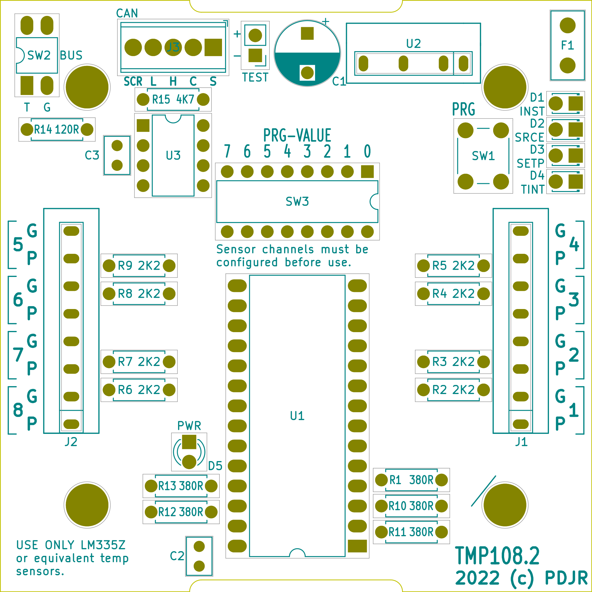

# TMP106 - NMEA 2000 temperature sensor module

**TMP106** is a specialisation of
[NOP100](https://www.github.com/preeve9534/NOP100)
which implements a six channel temperature sensor module.

The module presents on the NMEA bus as a device with Class Code 75
(Sensor Communication Interface) and Function Code 130 (Temperature)
and reports its status through transmission of
[PGN 130316 Temperature, Extended Range](https://www.nmea.org/Assets/nmea%202000%20pgn%20130316%20corrigenda%20nmd%20version%202.100%20feb%202015.pdf)
messages.

The module is powered from the host NMEA bus and has an LEN of 1.0.

Multiple **TMP106** modules can be installed on a single NMEA bus.

## Temperature Sensors

**TMP106** uses the
[Maxim DS18B20](https://www.hobbytronics.co.uk/datasheets/DS18B20.pdf)
temperature sensor.

The module has six electrically isolated three-pole terminal blocks
(labelled A through F) to which temperature sensor devices can be
connected.
Each terminal block provides +5VDC, GND and data connections all of
which must be wired to a connected sensor: the two-wire (parasitic)
operating  mode of the DS18B20 is not supported.

The total maximum length of cable that can be used to connect all
sensors is limited and the depends somewhat on environmental
conditions (particularly temperature and electrical noise) and the
type of cable used to make sensor connection.
The sum of all sensor connection cable lengths should be kept below
20 metres.

## Temperature reporting

**TMP106** treats each connected temperature sensor as an independent
device and maintains a persistent 1:1 mapping between a sensor's
hardware address and its user configured NMEA instance number.

The module can transmit PGN 130316 temperature reports at a maximum
rate of two reports per second.
The rate at which a sensor channel can report its temperature is user
configurable up to a maximum rate of one report every two seconds.

These timing constraints derive from implementation of the NMEA 2000
specification and raise a potential issue: if every sensor attempts
to transmit at the maximum rate, then six sensor reports will be
generated every two seconds whilst only four reports can actually
be transmitted in the same time interval.
The reporting intervals of at least some sensor channels on a module
installation must be chosen so that overrun and possible data loss
do not become an issue.

## Module operating modes

**TMP106** provides both *normal* and *extended* operating modes.

### Normal operating mode

In normal operating mode the module takes temperature readings from
registered sensors and broadcasts them as NMEA temperature reports for
configured sensor channels.

The transmit LED will normally be off, but will flash once each time a
message is broadcast into the NMEA bus or, if a configuration change is
being made, it will flash rapidly to indicate that a configuration
address has been entered and the module is awaiting entry of a
configuration value.

Sensor channel LEDs will normally be OFF, but each sensor LED wil flash
once each time a reading is taken from the associated temperature
sensor or, if a configuration change is being made, it will flash twice
to indicate that an updated value has been saved to the module
configuration of the associated sensor. 

In normal operating mode the module configuration can be updated at any
time by modifying the discrete byte-sized values which make up the
persistent module configuration table
(see
[Appendix I - Module configuration table](#Appendix I - Module configuration table)
).

### Extended operating mode

In extended operating mode the module stops normal operation and
waits for the user to enter codes that will execute functions which
support installation and automate some aspects of module configuration.

In extended operating mode the transmit LED will normally be steadily
on, but will flash rapidly to indicate that a function code has been
accepted and the module is awaiting entry of function argument.

Sensor channel LEDs will flash continuously to indicate that a sensor
hardware address has been registered for the associated channel and will
remain stedily on if the registered is currently connected to the
module.

See [Appendix II - Module function table](#Appendix II - Module function table))
for a description of the functions available in extended mode.

### Switching between normal and extended operating modes

The module can be switched between operating modes by:

1. Pressing and promptly releasing PRG.

The module will automatically revert from extended mode to normal mode
if there is no user input for a period of 30 seconds.

## Configuration of the module

Before **TMP106** can perform its normal function one or more DS18B20
temperature sensors must be registered with the module and assigned to
a sensor channel.

Additionally, each sensor channel which has a sensor assigned must have
its NMEA properties appropriately configured.

### Registering and de-registering DS18B20 temperature sensors

The purpose of registration is to associate a particular physical
sensor with a particular sensor channel.
Once registered, a sensor can be connected to any of the module
inputs, A-F, but will always be associated with the sensor channel
against which it was registered.

If a DS18B20 fails or is no longer required for service with its
host TMP106 then it must be de-registered to free-up the associated
sensor channel for possible future use with another device.

Sensor devices can only be registered with and de-registered whilst
the module is in extended mode.

#### Registering a sensor

1. Connect a new (as in currently not registered) DS18B20 device to an
   unoccupied sensor connection, A-F.
2. Ensure that the module is in extended operating mode by checking
   that the transmit LED is steadily on.
   If not, switch the module into extended mode as described above.
3. Enter the function code (between 0x01 and 0x06) of the sensor
   channel to which the new device should be associated into the
   ADDR/VALUE DIL switch.
   The value entered must correspond to an unregistered sensor channel:
   i.e. one associated with a display LED which is not illuminated.
4. Press and hold the PRG button for 1s before releasing.
   The transmit LED will flash continuously.
5. Press and immediately release the PRG button.
   The transmit LED will revert to being steadily on.

On completion of step (4), the module will scan the sensor bus looking
for an unregistered sensor device and, if one is found, will register
the device with the selected sensor channel.
If registration is successful the LED associated with the selected
channel will steadily illuminate.

If the DS18B20 cannot be detected and/or registered withing 20 seconds
then the registration attempt will be aborted and the associated LED
will remain off.

#### De-registering a sensor

1. Ensure that the module is in extended operating mode by checking
   that the transmit LED is steadily on.
   If not, switch the module into extended mode as described above.
2. Enter the de-registration function code for the sensor channel you
   wish to update into the ADDR/VALUE DIL switch.
   This will be one of the values 0x10, 0x20, 0x30, 0x40, 0x50 or 0x60.
3. Press and hold the PRG button for 1s before releasing.
   The transmit LED will flash continuously.
4. Press and immediately release the PRG button.
   The transmit LED will revert to being steadily on.

The LED associated with the selected channel will switch off.

### Configuring a sensor channel's NMEA properties

Each sensor channel is characterised by an instance number (which
identifies the sensor on the NMEA network) and a sampling interval
which sets the period between consecutive sensor reading and will
broadly correspond to the rate at which the sensor reading is
broadcast onto the NMEA bus.

The instance number of all channels defaults to 0xFF which value
disables the channel.
You can configure instance numbers for all sensor channels (and so
enable all channels) as a block using an extended mode function, or
you can set the instance number of each channel individually using
the normal mode configuration dialogue which will allow you to
similarly set all of the other sensor channel properties. 

Note that if you use the extended mode function to assign a block
of instance numbers you will still need to set other sensor channel
properties through normal mode configuration.

The default sampling intervals are chosen in such a way that the
broadcast characteristics of sensor readings will obey the requirements
of the NMEA 2000 specification: if you need to change these, then read
the advice note
[Choosing sampling intervals](#Choosing sampling intervals)
at the end of this section.

#### Set the instance number of all sensors at once

To configure the instance number of all six sensor channels to
consecutive values from a specified start value:

1. Ensure that the module is in extended operating mode by checking
   that the transmit LED is steadily on.
   If not, switch the module into extended mode as described above.
2. Enter the BASSINST function code (0xE0) into the ADDR/VALUE DIL
   switch.
3. Press and hold the PRG button for 1s before releasing.
   The transmit LED will flash continuously.
4. Enter the instance number you wish to use for sensor channel one on
   the ADDR/VALUE DIL switch.
5. Press and release the PRG button.
   The transmit LED will revert to being steadily on.

The instance number you specify at (2) must be in the range 0..247 and
none of the values in the range *n*..(*n* + 5) may be in use as the
instance number of any existing or planned temperature sensor on the
host NMEA bus.

#### Set the instance number of a single sensor channel

1. Enter the address of the sensor instance number on the
   ADDR/VALUE DIL switch.
2. Press and hold the PRG button for 1s before releasing.
   The module's transmit LED will begin to flash rapidly.
3. Enter the instance number you wish to use for the selected sensor
   channel on the ADDR/VALUE DIL switch.
4. Press and release the PRG button.
   The module's transmit LED will stop flashing.

Select your instance numbers with care: the number used must not be
in use by any other temperature sensor on the host NMEA bus and
must be in the range 0 through 252.

You can disable a sensor channel by setting its instance number to
0xff.

#### Set any property on a sensor channel

Sensor transmission intervals are set in a similar way to sensor instance
numbers by specifying an appropriate parameter address and value for
the sensor channel transmission interval in seconds.
The minimum valid transmission interval is 0x02.

Note that the NMEA 2000 specification requires that modules transmitting
PGN 130316 honour a 0.5s maximum transmission rate and that an individual
sensor report is not transmitted more frequently than once every 2 seconds.
 
These constraints raise a potential issue. If every sensor attempts to
transmit at the maximum rate, then six sensor reports be generated every
two seconds whilst only four messages can actually be transmitted in the
same time interval.
Make sure that when you configure sensor channels you choose an
appropriate range of transmit intervals so that transmission overrun
and possible data loss do not become an issue.

The module will immediately begin transmitting tempersture sensor
report messages for all connected sensors on their configured instance
numbers.

Setting the module's default transmission interval
In most cases the default transmission interval of four seconds will not need to be altered. The NMEA 2000 specification dictates an appropriate transmission frequency range for PGN 127501 and it is sensible to respect this constraint.

If you do wish to change the rate, then enter the value 0x02 on the ADDR/VALUE DIL switch and press and hold the PRG button for two seconds and then release. The module's transmit LED will begin to flash rapidly. Enter your required transmission interval in seconds on the ADDR/VALUE DIL switch and press and release PRG. The new transmission rate will be applied the next time the module is power cycled.

## State of development

A complete, functional, implementation is available as
[TMP108.2]().
Key features of the design/implementation are: 

1. Easy bus connection by a standard M12 5-pin plug.
2. Installer selectable 120 Ohm termination resistor allows
   connection as either a bus drop or a bus termination node.
3. Powered directly from the NMEA bus with an LEN of 1.
4. Supports home-brew and commercially available LM335Z temperature
   sensors.
5. Operating status indicated by externally visible LED.
6. Fully field configurable through a simple DIL-switch based
   configuration protocol.
7. Easy assembly afforded by PCB with well marked component
   locations and 100% through-hole mounting.
8. Support for remote configuration of the module is not currently
   available, but is a work in progress.

## Hardware

### PCB

The module PCB is a 75mm x 75mm square. 

### Electronic components

| Component   | Description                                     | Further information
|------------ |------------------------------------------------ |--------------------- |
| C1          | 1000uF aluminium capacitor                      | [711-1148](https://uk.rs-online.com/web/p/aluminium-capacitors/7111148)
| C2,C3       | 100nF ceramic capacitor]                        | [538-1427](https://uk.rs-online.com/web/p/mlccs-multilayer-ceramic-capacitors/5381427)
| D1,D2,D3,D4 | 2V 1.8mm rectangular LED                        | [229-2425](https://uk.rs-online.com/web/p/leds/2292425)
| D5          | 2V 3.0mm circular LED                           | [228-5916](https://uk.rs-online.com/web/p/leds/2285916)
| F1          | ECE BU135 1.35A polymer fuse                    | [ECE](https://www.ece.com.tw/images/cgcustom/file020170930043926.pdf)
| J1,J2       | Phoenix Contact FK-MPT terminal block 1x8 3.5mm | [229-2425](https://uk.rs-online.com/web/p/pcb-terminal-blocks/8020169)
| J3          | Phoenix Contact MPT terminal block 1x5 2.54"    | [220-4298](https://uk.rs-online.com/web/p/pcb-terminal-blocks/2204298)
| R1,R10-R13  | 390R 0.25W resistor                             | [707-7634](https://uk.rs-online.com/web/p/through-hole-resistors/7077634)
| R3-R9       | 2K2 0.25W resistor                              | [707-7690](https://uk.rs-online.com/web/p/through-hole-resistors/7077690)
| R14         | 120R 0.25W resistor                             | [707-7599](https://uk.rs-online.com/web/p/through-hole-resistors/7077599)
| SW1         | 6mm momentary push button                       | Sourced from eBay
| SW2         | 2-way SPST DIP switch                           | [177-4261](https://uk.rs-online.com/web/p/dip-sip-switches/1774261)
| SW3         | 8-way SPST DIP switch                           | [756-1347](https://uk.rs-online.com/web/p/dip-sip-switches/7561347)
| U1          | PJRC Teensy 3.2 MCU                             | [PJRC](https://www.pjrc.com/store/teensy32.html)
| U2          | TracoPower TMR-1-1211 DC-DC converter           | [781-3190](https://uk.rs-online.com/web/p/dc-dc-converters/7813190)
| U3          | MCP2551-I/P CAN transceiver                     | [040-2920](https://uk.rs-online.com/web/p/can-interface-ics/0402920)
| SENSORS     | LM335Z - if you choose to make your own sensors | [159-4685](https://uk.rs-online.com/web/p/temperature-humidity-sensor-ics/1594685)

### Suggested hardware

| Component   | Description                                     | Further information
|------------ |------------------------------------------------ |--------------------- |
| ENCLOSURE   | Plastic, general purpose, flange mount box      | [919-0391](https://uk.rs-online.com/web/p/general-purpose-enclosures/9190391)
| J4          | M12 5-pin male NMEA bus connector               | [877-1154](https://uk.rs-online.com/web/p/industrial-circular-connectors/8771154)
| CLIP        | 3mm LED panel clip                              | Sourced from eBay

### Assembly

All components need to be placed and soldered with care taken to
ensure correct orientation and polarity.

The host NMEA bus can be wired directly to J3 or (and preferably)
ENCLOSURE can be drilled to accommodate J4 and J4's flying leads
connected to J3.
A good position for J4 is directly over the bottom right-hand PCB
mounting screw.

D5 can be soldered with long leads and a hole drilled in the
ENCLOSURE to expose the LED or (and preferably) preferably, D5 can
be mounted with CLIP to ENCLOSURE and trailing leads used to
connect D5 back to the PCB mounting location.
The latter approach means that exact positioning of the hole which
exposes the PCB mounted LED is not required except, of course, that
the LED must not foul a PCB component or cable path.

## Module configuration

It will almost always be simpler to configure the module on the bench
and then install it in its normal operating location.

Begin configuration by exposing the module PCB.

Make sure that the module is properly terminated for its method of
connection to the NMEA bus by performing any required hardware
configuration (see below).

Connect the module to the host NMEA bus: the module will boot and the
PWR LED will flash once.

You can now continue with firmware configuration.

### Hardware configuration

The BUS switch labelled 'T' allows a 120 Ohm terminating resistor to be
connected across the NMEA data bus.
Switch BUS.T OFF if you install the module via a T-connector and drop
cable or switch it ON if you install the module as a terminating device
on your NMEA bus backbone.

The BUS switch lagelled 'G' connects the NMEA bus shield to the module
GND when it is in the ON position.
Usually it is appropriate to leave this OFF.

### Firmware configuration

The module is configured by the application of one or more *protocol*s
each of which defines a sequence of one or more *step*s that are
required to perform a single configuration task.
A step involves setting up a configuration parameter on the PRG-VALUE
DIL switch and then entering it by briefly pressing the PRG button.

In a multi-step protocol after pressing PRG, you have 20 seconds to
complete the subsequent step, otherwise the protocol is abandoned and
the module will revert to normal operation.

The LEDs PWR, INST, SRCE, SETP and IVAL help guide you through each
protocol.

The PWR LED will flash one or more times after you press the PRG button.
A single flash means that your entry has been successfuly validated or
processed whilst more than one flash indicates that you entered an
invalid value on PRG-VALUE.
In the latter case you should correct the error by setting a new value
on PRG-VALUE and pressing PRG again to re-validate your entry.

The user-interaction LEDs flash to indicate whan a particular value should
be entered and become steady when an entry has been accepted.
When a protocol is successfully completed all four leds will flash
together.

#### PROTOCOL 128: Clear Module EEPROM

This single step protocol deletes all existing module settings, essentially
performing a 'factory reset'.

| PRG-VALUE  | DIL switch |Description |
|------------|------------|------------|
| 128        | [10000000] | Clear module EEPROM (deleting all channel configuration) |

#### PROTOCOL 64: Transmit Test Messages

This is a single step protocol which transmits a single, dummy, PGN
130316 message for each sensor channel.
This is especially helpful when commissioning a new installation
since it allows you to use an NMEA monitor application or instrument
to confirm that the module and its NMEA bus connection are operating
without having to perform any channel configuration.

| PRG-VALUE  | DIL switch |Description |
|------------|------------|------------|
| 64         | [01000000] | Transmit a single, dummy, PGN 130316 for each channel |

#### PROTOCOL 1..8: Delete Sensor Channel

This two-step protocol deletes any existing configuration for a
specified channel.

| PRG-VALUE  | DIL switch |Description |
|------------|------------|------------|
| 1..8       | [0000XXXX] | Number of the sensor channel that should be deleted. |
| 255        | [11111111] | Delete sensor channel configuration. |

#### PROTOCOL 1..8: Configure Sensor Channel

This five-step protocol configures a sensor channel and enables its
transmission on the NMEA bus.

Its a good idea to refer to
[this NMEA document](https://www.nmea.org/Assets/nmea%202000%20pgn%20130316%20corrigenda%20nmd%20version%202.100%20feb%202015.pdf)
which discusses the values you will need to enter.

| PRG-VALUE       | DIL switch |Description |
|-----------------|------------|------------|
| 1..8            | [0000XXXX] | Number of the sensor channel to be configured. |
| 0..252          | [XXXXXXXX] | NMEA temperature instance. |
| 0..14, 129..252 | [XXXXXXXX] | NMEA temperature source. |
| 1..255          | [XXXXXXXX] | NMEA temperature set point divided by 2. |
| 2..255          | [XXXXXXXX] | Transmission interval in seconds. |

Some things to consider:

1. It is usually sensible to set the temperature instance value to the
   sensor channel number, so STEP 2 simply becomes a press of PRG.

2. The temperature set point is expressed in degrees Kelvin divided by
   two, so to configure a set point for 100C you need to enter
   (100 + 273) / 2 or 186 [10111010] (actually setting represents 99C).

3. Consider reducing the transmission rate of a sensor as much as seems
   reasonable and so avoid consuming bus bandwidth unnecessarily.
   Usually, real world temperature values change slowly.

   Compliance with the NMEA specification means that no more than three
   sensor channels can be used at the minimum transmission interval of
   2s without consequent data loss.

## Temperature sensors

The TMP108 module supports a maximum of eight
[LM335Z](https://www.st.com/resource/en/datasheet/lm335.pdf)
temperature sensor ICs.
Other types of temperature sensor cannot be used and connecting them
to a TMP108 module will almost certainly damage the module beyond
repair.

LM335Z-based temperature sensors packaged for marine use are
commercially available, but you can easily (and inexpensively) make
your own sensor and one method I have used is described below.

### Making a bolt-on temperature sensor

You will require an LM335Z IC in a TO-92 package, a length of two-core
cable with 0.5mm2 colour-coded conductors (two-core telephone cable
works well), a minimum 10mm2 ring terminal with a hole size that suits
your mounting needs and some silicone sealer or other potting compound.

Consult the data sheet referenced above to determine the pin layout of
your sensor IC.

1. Remove the calibrate pin from the LM335Z by cutting or breaking it
   off as close to the IC body as possible.

2. Solder an appropriate length of two-core cable to IC pins G and P.
   Make sure you can identify which pin connects to which cable core!
   Insulate the exposed connection is some way, perhaps using small
   diameter heat-shrink sleeving around each connection.

3. Fill the cable-entry port of the ring terminal with silicone-sealant
   and coat the LM335Z with sealant as well.
   Try to avoid air bubbles.

4. Fully immerse the LM335Z in the ring-terminal cable-entry port so
   that the electrical connections are completely embedded in the
   sealant and making sure that they do not touch the ring-terminal
   body.

5. Allow the sealant to fully cure.

Ordinary silicone-sealant and potting compounds are not wonderful
conductors of heat so it is good to keep the volume of these low.
Thermally conductive silicone-sealant and potting compounds perform
better, but are expensive.

## Appendix I - Module configuration table

The module configuration tabel is a 31-byte array with the following
structure.

| Address | Name                       | Default value | Description |
| :---:   | :---                       | :---:         | :--- |
| 0x00    | CAN SOURCE ADDRESS         | 0x22          | RESERVED |
| 0x01    | SENSOR 1 INSTANCE NUMBER   | 0xFF          | Instance number for sensor one. |
| 0x02    | SENSOR 1 SAMPLING INTERVAL | 0x03          | Sampling interval in seconds for sensor one. |
| 0x03    | SENSOR 1 NMEA TEMP SOURCE  | 0x02          | NMEA temperature source code. |
| 0x04    | SENSOR 1 SET POINT TEMP HI | 0xFF          | NMEA set point temperature high-byte. |
| 0x05    | SENSOR 1 SET POINT TEMP LO | 0xFF          | NMEA set point temperature low-byte. |

| 0x06    | SENSOR 2 INSTANCE NUMBER   | 0xFF          | Instance number for sensor two. |
| 0x07    | SENSOR 2 SAMPLING INTERVAL | 0x03          | Sampling interval in seconds for sensor two. |
| 0x08    | SENSOR 2 NMEA TEMP SOURCE  | 0x02          | NMEA temperature source code. |
| 0x09    | SENSOR 2 SET POINT TEMP HI | 0xFF          | NMEA set point temperature high-byte. |
| 0x0A    | SENSOR 2 SET POINT TEMP LO | 0xFF          | NMEA set point temperature low-byte. |

| 0x0B    | SENSOR 3 INSTANCE NUMBER   | 0xFF          | Instance number for sensor three. |
| 0x0C    | SENSOR 3 SAMPLING INTERVAL | 0x07          | Sampling interval in seconds for sensor three. |
| 0x0D    | SENSOR 3 NMEA TEMP SOURCE  | 0x02          | NMEA temperature source code. |
| 0x0E    | SENSOR 3 SET POINT TEMP HI | 0xFF          | NMEA set point temperature high-byte. |
| 0x0F    | SENSOR 3 SET POINT TEMP LO | 0xFF          | NMEA set point temperature low-byte. |

| 0x10    | SENSOR 4 INSTANCE NUMBER   | 0xFF          | Instance number for sensor four. |
| 0x11    | SENSOR 4 SAMPLING INTERVAL | 0x07          | Sampling interval in seconds for sensor four. |
| 0x12    | SENSOR 4 NMEA TEMP SOURCE  | 0x02          | NMEA temperature source code. |
| 0x13    | SENSOR 4 SET POINT TEMP HI | 0xFF          | NMEA set point temperature high-byte. |
| 0x14    | SENSOR 4 SET POINT TEMP LO | 0xFF          | NMEA set point temperature low-byte. |

| 0x15    | SENSOR 5 INSTANCE NUMBER   | 0xFF          | Instance number for sensor five. |
| 0x16    | SENSOR 5 SAMPLING INTERVAL | 0x0D          | Sampling interval in seconds for sensor five. |
| 0x17    | SENSOR 5 NMEA TEMP SOURCE  | 0x02          | NMEA temperature source code. |
| 0x18    | SENSOR 5 SET POINT TEMP HI | 0xFF          | NMEA set point temperature high-byte. |
| 0x19    | SENSOR 5 SET POINT TEMP LO | 0xFF          | NMEA set point temperature low-byte. |

| 0x1A    | SENSOR 6 INSTANCE NUMBER   | 0xFF          | Instance number for sensor six. |
| 0x1B    | SENSOR 6 SAMPLING INTERVAL | 0x0D          | Sampling interval in seconds for sensor six. |
| 0x1C    | SENSOR 6 NMEA TEMP SOURCE  | 0x02          | NMEA temperature source code. |
| 0x1D    | SENSOR 6 SET POINT TEMP HI | 0xFF          | NMEA set point temperature high-byte. |
| 0x1E    | SENSOR 6 SET POINT TEMP LO | 0xFF          | NMEA set point temperature low-byte. |

## Appendix II - Module function table

| Address | Value   | Function |
| :---:   | :---    | :--- |
| 0x01    | Any     | Detect and assign sensor hardware address to sensor 1 |
| 0x02    | Any     | Detect and assign sensor hardware address to sensor 2 |
| 0x03    | Any     | Detect and assign sensor hardware address to sensor 3 |
| 0x04    | Any     | Detect and assign sensor hardware address to sensor 4 |
| 0x05    | Any     | Detect and assign sensor hardware address to sensor 5 |
| 0x06    | Any     | Detect and assign sensor hardware address to sensor 6 |
| 0x10    | Any     | De-assign sensor hardware address from sensor 1       |
| 0x20    | Any     | De-assign sensor hardware address from sensor 2       |
| 0x30    | Any     | De-assign sensor hardware address from sensor 3       |
| 0x40    | Any     | De-assign sensor hardware address from sensor 4       |
| 0x50    | Any     | De-assign sensor hardware address from sensor 5       |
| 0x60    | Any     | De-assign sensor hardware address from sensor 6       |
| 0xE0    | *start* | Assign a sequential block of instance adresses to sensors 1 through 6, beginning at address *start* | 

